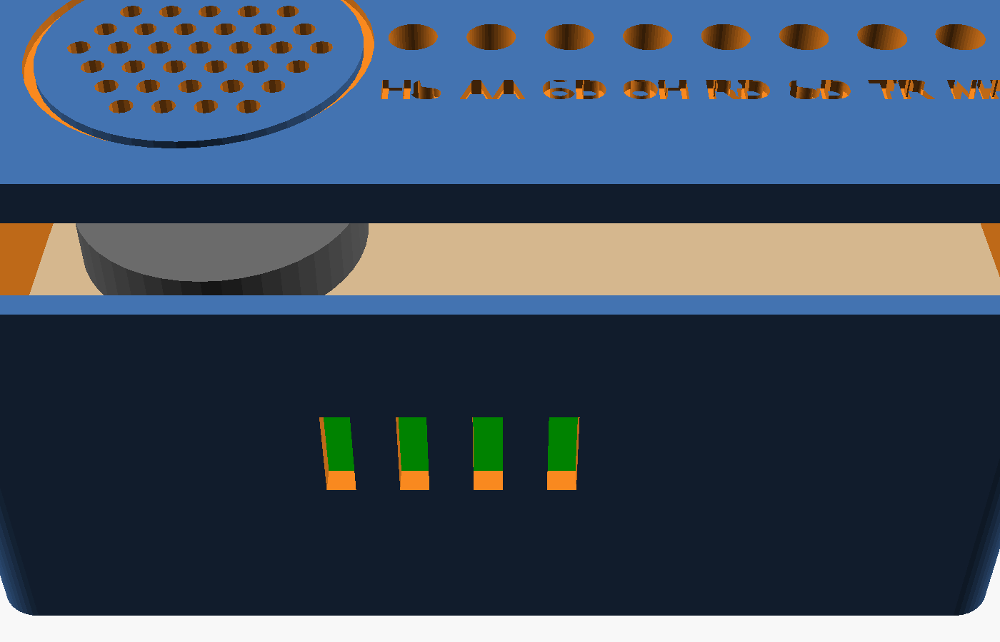
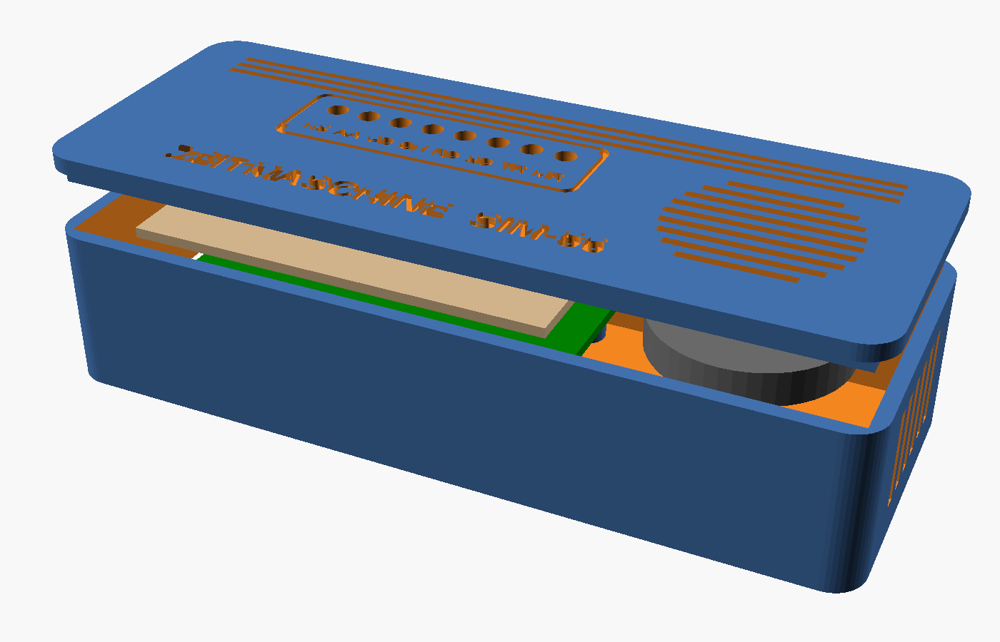
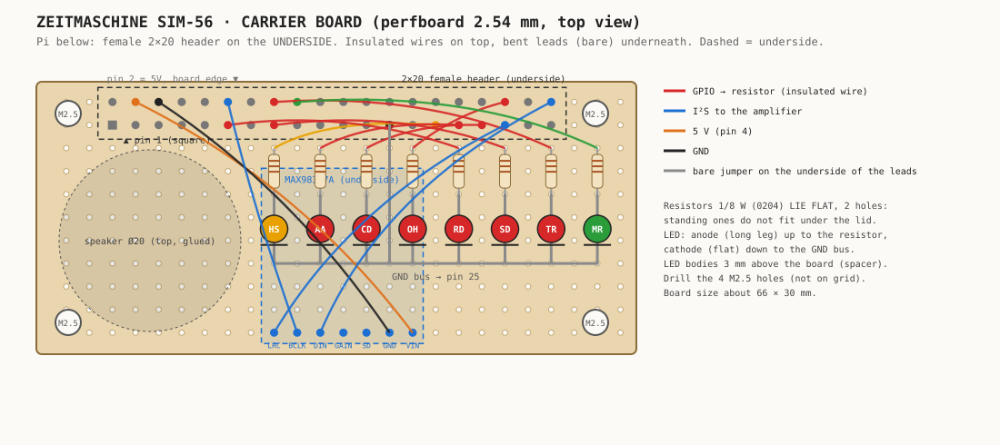

# Bauanleitung: der Zeitmaschine-Stick



Du baust einen USB-Stick, der ein kleines Modem ist: ein Raspberry Pi Zero 2 W mit der
Zeitmaschine-BBS, acht Modem-Lämpchen wie bei einem echten Modem der 90er und auf Wunsch
einem Lautsprecher. Am PC steckt er einfach in einem USB-Port: Der liefert den Strom, und
über dasselbe Kabel erreichst du SSH, Web-Simulator und Telnet.

**Aufbau von unten nach oben:** Gehäuseboden → USB-Adapter → Pi Zero 2 W →
11-mm-Abstandshalter → Trägerplatine (LEDs, Widerstände, optional Verstärker und
Lautsprecher) → Deckel.

**Zwei Bauformen, gleiche Elektronik:**

| | Stick | Tischmodem |
|---|---|---|
| Aussehen | USB-Stick mit LED-Leiste | kleines 90er-Tischmodem, 118 × 46 × 28 mm |
| Anschluss | steckt direkt im PC (USB-A-Adapter V1.1) | Micro-USB-Kabel an der Rückseite |
| Lautsprecher | 20 mm | 28 mm unter einem Schlitzgitter |
| Dateien | `case/case.scad`, `bottom.stl`, `lid.stl` | `case/desk.scad`, `desk-bottom.stl`, `desk-lid.stl` |



Beim Tischmodem fällt der USB-Adapter weg: Das Kabel steckt in der Buchse des Pi, die mit
**USB** beschriftet ist (nicht PWR). Darüber bekommt er Strom und Netzwerk, genau wie beim Stick.

**Zeitbedarf:** etwa 2 bis 3 Stunden plus rund 3 Stunden Druckzeit.
**Schwierigkeit:** einfaches Löten auf Lochraster, keine SMD-Teile.

## 1. Teile und Werkzeug

Die vollständige Liste steht in [`hardware/BOM.md`](../../hardware/BOM.md).
Die Pläne:

- Schaltplan: [`hardware/wiring/schematic.svg`](../../hardware/wiring/schematic.svg)
- Lochrasterplan: [`hardware/wiring/carrier.svg`](../../hardware/wiring/carrier.svg)

## 2. Zuerst die Software

Bevor du lötest, soll der Stick schon laufen. So weißt du, dass Pi und USB-Adapter
funktionieren, und kannst die LEDs danach sofort testen.

1. **SD-Karte beschreiben:** Raspberry Pi Imager → Gerät *Raspberry Pi Zero 2 W* →
   *Raspberry Pi OS Lite (64-bit)*. In den Einstellungen: Hostname `zeitmaschine`,
   Benutzer, dein WLAN und **SSH mit deinem öffentlichen Schlüssel**.
2. **Pi starten** (vorerst ganz normal am Netzteil oder schon am USB-Adapter) und warten,
   bis er im WLAN auftaucht: `ssh <user>@zeitmaschine.local`
3. **Installieren:**
   ```sh
   scp zeitmaschine-<version>.tar.gz <user>@zeitmaschine.local:
   ssh <user>@zeitmaschine.local
   tar xzf zeitmaschine-<version>.tar.gz && cd zeitmaschine
   sudo ./install.sh --stick
   sudo reboot
   ```
4. **Testen:** Stick in den PC stecken, etwa 30 Sekunden warten, dann
   `ssh <user>@10.55.0.1`. Es erscheint das S.A.S.-Anmeldebild. Im Browser
   `http://10.55.0.1:8056/` öffnen und einmal anrufen.

Ohne Trägerplatine läuft alles, die LEDs bleiben nur dunkel.

## 3. Trägerplatine



### 3.0 Stiftleiste am Pi
Hat dein Pi noch keine GPIO-Stiftleiste (Zero 2 W ohne „H“), löte zuerst die 2×20-Stiftleiste
ein: kurze Seite durch den Pi, die langen Stifte zeigen nach oben. Erst die beiden äußeren
Pins anlöten, Sitz prüfen, dann den Rest.

### 3.1 Zuschneiden und bohren
1. Lochraster auf etwa **66 × 30 mm** zuschneiden.
2. **Trick für perfekte Ausrichtung:** Stecke die Buchsenleiste auf die Stiftleiste des Pi
   und lege das Lochraster so darauf, dass die Beinchen der Buchsenleiste durch die Löcher
   ragen. Jetzt sitzt das Raster exakt über dem Pi.
3. Die vier Befestigungslöcher des Pi von unten mit einem spitzen Stift auf das Lochraster
   übertragen und mit **2,5 bis 2,8 mm** aufbohren. Sie liegen nicht im Raster, das ist richtig so.

### 3.2 Buchsenleiste
Die 2×20-Buchsenleiste sitzt auf der **Unterseite**, gelötet wird oben. Pin 1 ist im Plan
das eckige Pad. Die 5-V-Pins (2 und 4) liegen an der Platinenkante.

### 3.3 Widerstände, LEDs, Masse
1. **Widerstände** liegend einlöten, je einer in der Spalte über seiner LED, zwei Rasterabstände
   lang. Nimm kleine 1/8-W-Typen (Bauform 0204): Stehende Widerstände sind zu hoch für den Deckel.
2. **LEDs:** langes Bein (Anode) nach oben zum Widerstand, abgeflachte Seite (Kathode)
   nach unten. Der LED-Körper steht **3 mm über der Platine**: mit Abstandshaltern oder
   einem 3-mm-Pappstreifen beim Löten. Später werden die Kuppen in die Deckellöcher gedrückt.
3. **Masse-Schiene:** Ein blanker Draht in der Reihe unter den LEDs verbindet alle Kathoden
   und führt über die Spalte zwischen HS und AA zu **Pin 25 (GND)**.
4. Widerstand unten und LED-Anode mit einem kurzen blanken Stück (abgeschnittenes Beinchen)
   verbinden.

### 3.4 Verdrahtung
Isolierte dünne Drähte vom GPIO-Pin zum oberen Ende des jeweiligen Widerstands:

| LED | Farbe | GPIO | Pin | Bedeutung |
|---|---|---|---|---|
| HS | gelb/amber | 5 | 29 | schneller Anrufer (ab 9600 bit/s) |
| AA | rot | 6 | 31 | Auto Answer: Box nimmt Anrufe an |
| CD | rot | 13 | 33 | Carrier: Anrufer ist durch die Login-Fragen |
| OH | rot | 16 | 36 | Off Hook: jemand ist verbunden |
| RD | rot | 17 | 11 | Receive Data (flackert) |
| SD | rot | 22 | 15 | Send Data (flackert) |
| TR | rot | 23 | 16 | Gateway ist nach draußen verbunden |
| MR | grün | 24 | 18 | Modem Ready: Server läuft |

Freilassen: GPIO 2/3 (I²C), 14/15 (UART) und 18/19/21 (für den Lautsprecher).

### 3.5 Prüfen, bevor es Strom gibt
- Mit dem Multimeter: **kein Kurzschluss zwischen 5 V (Pin 2/4) und GND (Pin 6/25).**
- Jeder GPIO-Pin muss über den Widerstand an genau seiner LED ankommen.
- Nirgends darf 5 V an einen GPIO kommen. Die GPIOs vertragen nur 3,3 V.

## 4. Lautsprecher (optional)

1. Den **MAX98357A** auf der **Unterseite** platzieren (gestrichelt im Plan), die Beinchen
   durch die Platine stecken und oben verlöten.
2. Verdrahten: VIN → Pin 4 (5 V), GND → Pin 6, BCLK → Pin 12, LRC → Pin 35, DIN → Pin 40.
   GAIN und SD bleiben offen (9 dB, Mono aus beiden Kanälen).
3. **Stick:** den 20-mm-Lautsprecher oben an der markierten Stelle aufkleben.
   **Tischmodem:** den 28-mm-Lautsprecher in den Haltering unter dem Deckel drücken.
   Dann an + / − des Verstärkers anschließen.
4. Auf dem Pi in `/boot/firmware/config.txt` die Zeile `#dtoverlay=max98357a` aktivieren
   (Raute entfernen), neu starten und testen:
   `speaker-test -c 1 -t sine -f 1000 -l 1`

Dass der Stick bei Anrufen selbst kreischt, kommt in einer späteren Version.

## 5. Gehäuse drucken

- Stick: `hardware/case/bottom.stl` und `lid.stl` · Tischmodem: `desk-bottom.stl` und `desk-lid.stl`
- PLA oder PETG, 0,2 mm Schichthöhe, 3 Wände, 15 bis 20 % Füllung, **ohne Stützen**
- Der Deckel liegt in der STL schon richtig: Oberseite aufs Bett. So werden die gravierten
  Beschriftungen besonders sauber.
- Tipp für den Retro-Look: die Gravuren mit Acrylfarbe oder Wachsstift ausfüllen und
  abwischen.

Anderer USB-Adapter, andere LEDs oder ein anderer Lautsprecher? Die Maße stehen oben in
`hardware/case/case.scad`. OpenSCAD zeigt beim Rendern Außenmaß und Platz über dem
Lautsprecher an.

## 6. Zusammenbau

1. **Stick:** Die Nylonschrauben aus dem Adapter-Set **von unten** einsetzen (Köpfe unter dem
   Adapter), dazwischen wie gewohnt je eine Mutter als Abstand zum Pi. Auf die oben
   herausschauenden Gewinde die **11-mm-Abstandsbolzen** schrauben. Der Stapel liegt mit
   Schraubenköpfen und USB-Stecker in den Mulden im Boden, der Stecker schaut durch die Öffnung.
   Die vier Stempel unter dem Deckel drücken ihn später fest. Durch den Boden wird nicht
   geschraubt.
   **Tischmodem:** **M2.5 × 12** durch den Boden direkt in Pi und Abstandshalter; der Pi
   liegt mit den Micro-USB-Buchsen zur Rückwand.
2. Trägerplatine auf die Stiftleiste stecken und mit **M2.5 × 5** auf den Abstandshaltern
   festschrauben.
3. Deckel aufsetzen, dabei die LED-Kuppen in die Löcher führen. Er hält per Presspassung.
   Zu stramm oder zu locker: `lip_clr` in `case.scad` anpassen und den Deckel neu drucken.

## 7. Erster Start

Stick in den PC stecken:

1. Eine **Lichtwelle** läuft einmal hin und zurück (Selbsttest).
2. Danach leuchten **MR** und **AA**: Die Box ist bereit.
3. Ruf an, per Web-Simulator oder `telnet 10.55.0.1 2323`: **OH** und **CD** gehen an,
   **RD/SD** flackern bei jedem Zeichen, **HS** leuchtet ab 9600 bit/s.
4. Wähl im Telefonbuch eine echte Mailbox an: **TR** leuchtet, solange das Gateway draußen ist.

## 8. Fehlersuche

| Problem | Lösung |
|---|---|
| Eine LED bleibt dunkel | Polung prüfen (langes Bein zum Widerstand). Test: `echo 1 \| sudo tee /sys/class/leds/zm-mr/brightness` |
| Keine LED reagiert | `ls /sys/class/leds` muss `zm-*` zeigen; `journalctl -u zeitmaschine` nach „front panel LEDs“ durchsuchen |
| Falsche LED leuchtet | zwei Drähte vertauscht, mit der Tabelle oben vergleichen |
| Kein `usb0` am PC | Der USB-Adapter muss am Datenport sitzen; `systemctl status zm-gadget` |
| Deckel klemmt | `lip_clr` vergrößern (z. B. 0.35) |

## Sicherheit
- Nur ohne Strom löten.
- Niemals 5 V an einen GPIO: Die Pins des Pi sind nicht 5-V-tolerant.
- Vor dem ersten Einstecken auf Kurzschlüsse prüfen (Abschnitt 3.5).
